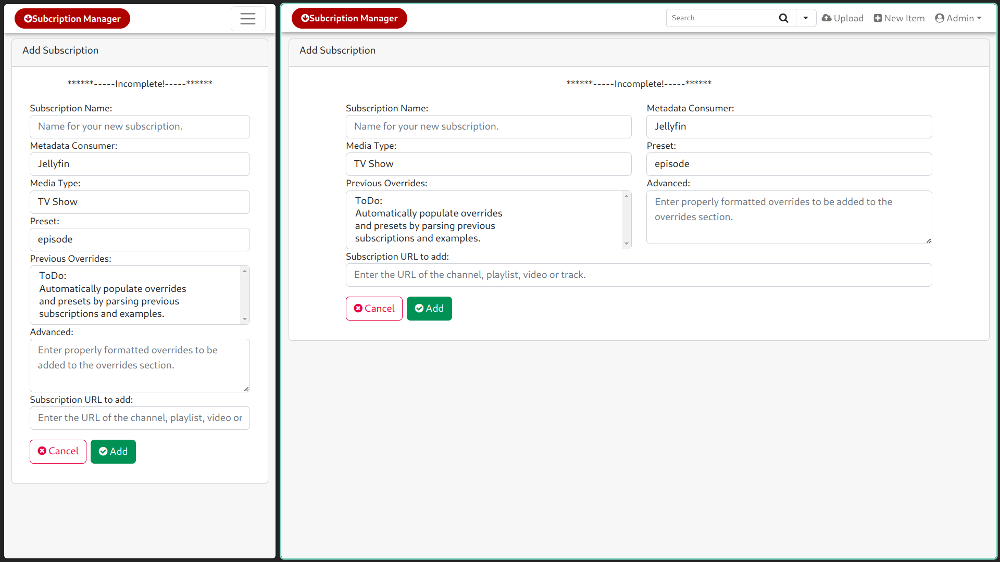
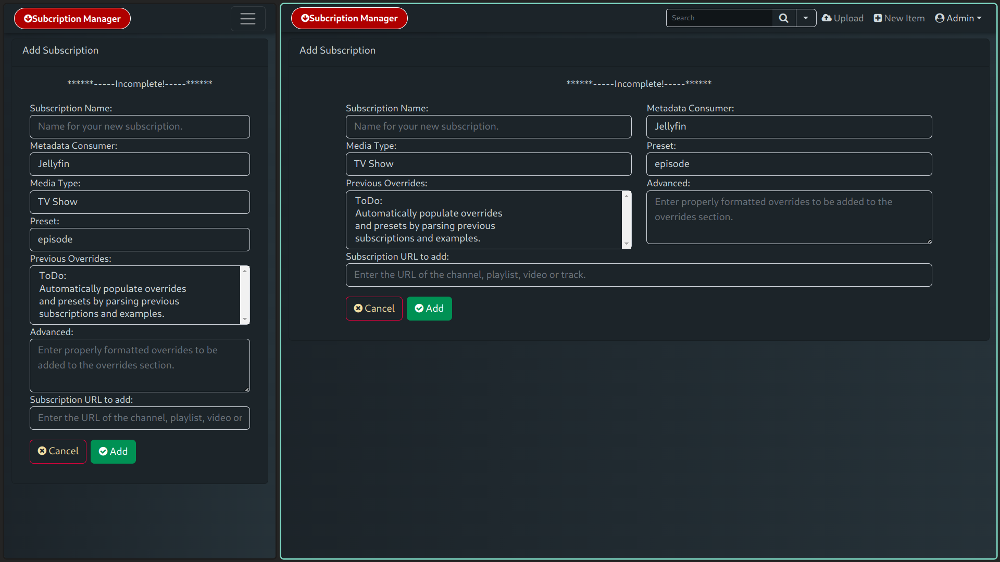
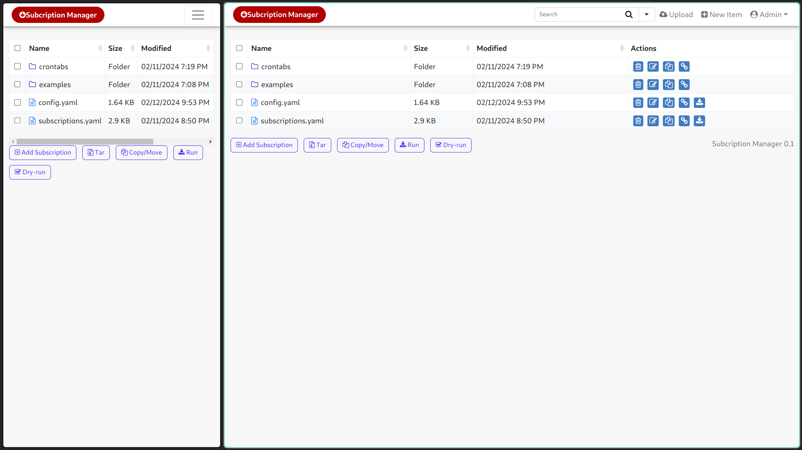
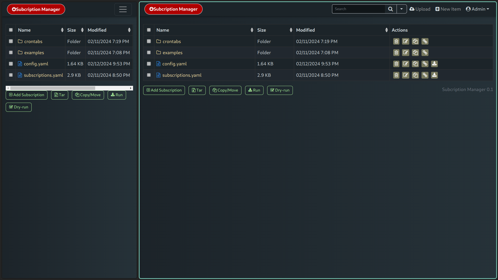
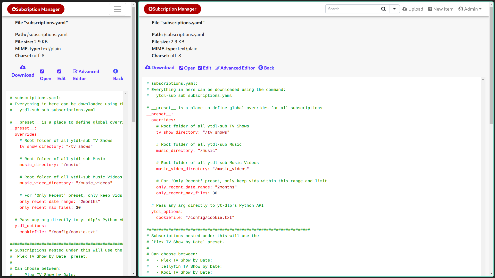
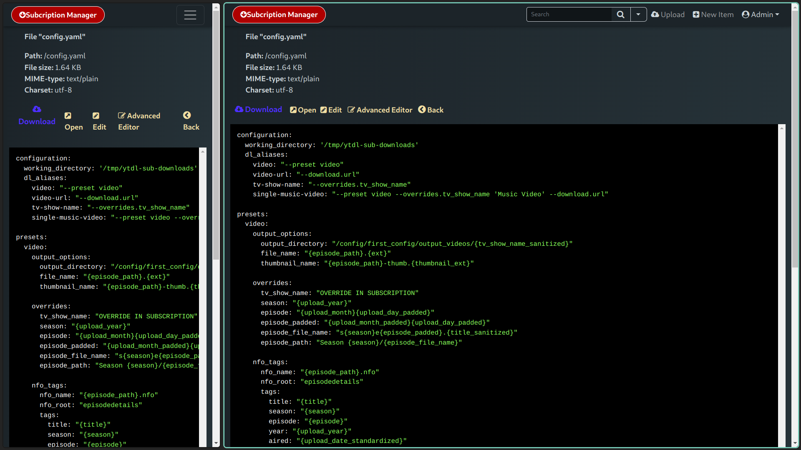
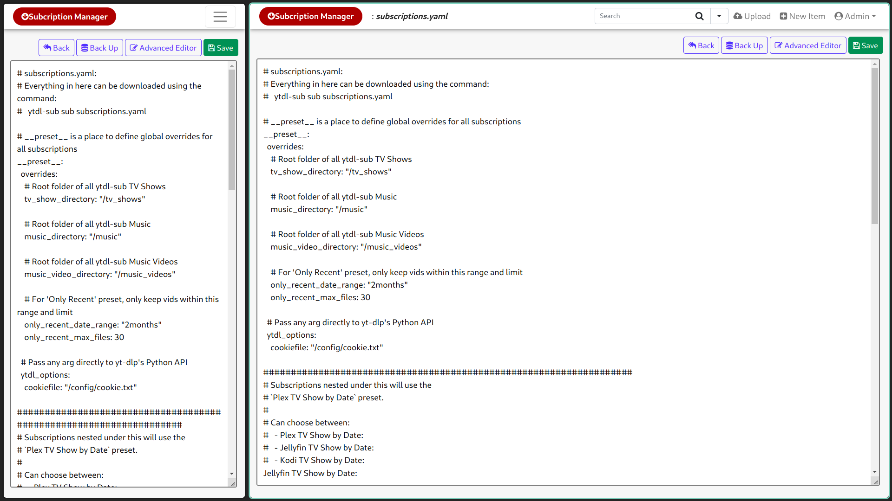
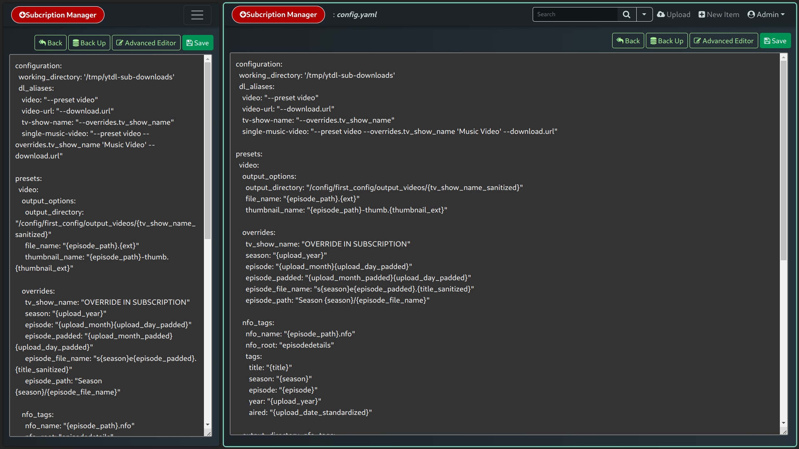
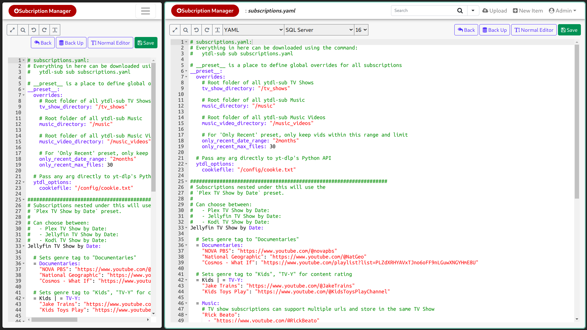
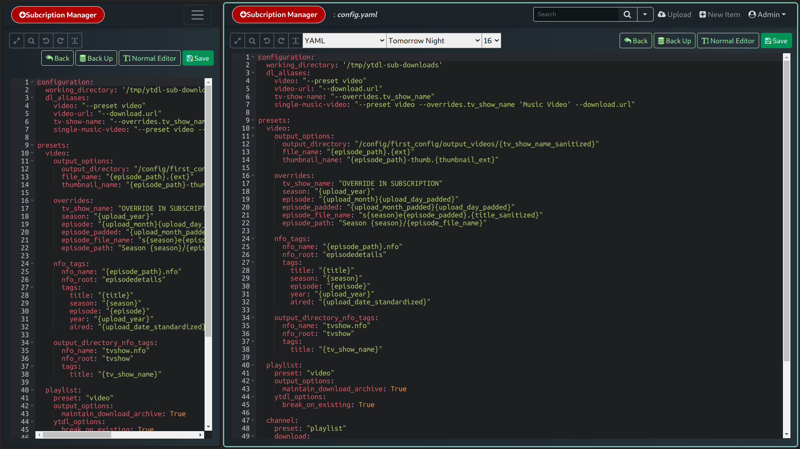

# Tiny Subscription Manager
Web gui for ytdl-sub based on [TinyFileManager](https://tinyfilemanager.github.io)
This is simply an overlay of tinyfilemanagers single file php page adding features to make using ytdl-sub slightly easier to use, maybe?

# **WIP**
## Roadmap
- [ ] ~~Connect Run and Dry-Run buttons to ytdl-sub via - /var/run/docker.sock:/var/run/docker.sock ?~~
  - Using docker.sock although easy it looks to be a security vulnerability. (see below for option b)
- [ ] Host and serve index.php using ytdl-sub container rather than in the tfm container. (safer than using docker.sock)
- [ ] Parse examples and previous yml files to populate presets and overrides with previously used code snippets
- [ ] Add ability to select a subscription.yml file and add it to the crontab via a button and interface
- [ ] Limit presets available in dropdown based on media type selected

In Progress:
- [ ] Collect and format data from add subscription interface and add to appropriate yml

Implemented:
- [x] Design interface for adding subscriptions
- [x] Cleanup UI by making extra features optional via the index.php variables
- [x] Add dark theme to text editor
- [x] Disable settings UI since we mount the index.php as RO to prevent tinyfilemanager from overwriting it
- [x] Make default advanced code editor theme configurable via index.php
- [x] Re-theme TFM to Tiny Subscription Manager

### :loudspeaker: Features

- :cd: Open Source, light and extremely simple
- :iphone: Mobile friendly view for touch devices
- :information_source: Basic features likes Create, Delete, Modify, View, Download, Copy and Move files
- :arrow_double_up: Ajax Upload, Ability to drag & drop, upload from URL, multiple files upload with file extensions filter
- :file_folder: Ability to create folders and files
- :gift: Ability to compress, extract files (`tar`)
- :sunglasses: Support user permissions - based on session and each user root folder mapping
- :floppy_disk: Copy direct file URL
- :pencil2: Cloud9 IDE - Syntax highlighting for over `150+` languages, Over `35+` themes with your favorite programming style
- :zap: Backup files and IP blacklist and whitelist
- :mag_right: Search - Search and filter files using `datatable js`
- :file_folder: Exclude folders and files from listing
- :globe_with_meridians: Multi-language(32+) support and for translations `translation.json` is file required
- :bangbang: lots more...

## Screenshots (mobile - desktop)
Light mode | Dark mode|
--- | ---
 | 
 | 
 | 
 | 
 | 

## Settings
All settings are via the index.php file 

Default username/password: **admin/admin@123** and **user/12345**.

:warning: Warning: Please set your own username and password in `$auth_users` before use. password is encrypted with <code>password_hash()</code>. To generate a new password hash please see the help menu and use the built in hash generator. Then enter the new hash and user name in the index.php file.

## Deploy by Docker

Make sure you have **already installed docker**, [Install reference](https://docs.docker.com/engine/install/)

> **Notice:** Your need an absolute path, and it will be served by tinyfilemanager.
> 
> If you want to serve this project at **raspberry pi or another special platform**, you can download the tinyfilemanager project and **build the the image yourself**.

Download the complete project to the location you would like to run the project from.
https://github.com/Intrinsically-Sublime/tiny-sub-webgui.git

Edit the docker-compose-yml file to set your folder bindings, timezone and port

To pull the tinyfilemanger and ytdl-sub docker images and start the program
```
docker compose up -d
```
To update
```
docker compose pull
docker compose up -d
```
Access the interface at http://localhost:3132

### <a name=license></a>License, Credit

- Available under the [GNU license](https://github.com/prasathmani/tinyfilemanager/blob/master/LICENSE)
- Original concept and development by github.com/alexantr/filemanager
- CDN Used - _jQuery, Bootstrap, Font Awesome, Highlight js, ace js, DropZone js, and DataTable js_
- To report a bug or request a feature, please file an [issue](https://github.com/prasathmani/tinyfilemanager/issues)
- [Contributors](https://github.com/prasathmani/tinyfilemanager/wiki/Authors-and-Contributors)
